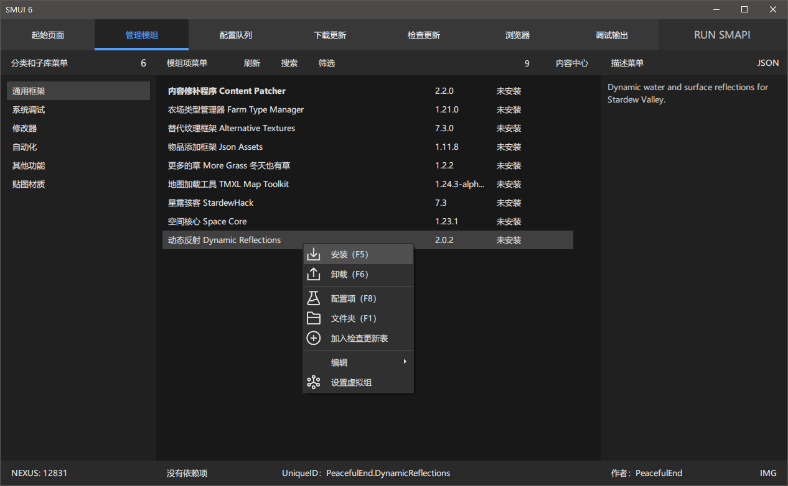

## 古希腊掌管星露谷模组管理的神 SMUI 2023 / 6

  

由 1059 Studio 再度打造的 SMUI 系列 第六代 星露谷模组管理器。基于 .NET 8 运行框架，使用 SunnyUI 设计的全新现代化交互界面，重新编写的更高性能的核心处理，更好的视觉效果，更高的集成度，全新的特性以及更多。

### [小白提醒：点这里去发行版下载安装程序，而不是下载仓库](https://github.com/Lake1059/SMUI-2023/releases)

寻找跨平台开发者：我没有技术开发其他操作系统上的版本，如果你有相应的前端能力并且能够调用 .NET 的 dll，欢迎联系我协商合作。Linux、macOS、Android、WebUI 都可以。

## 简介

SMUI 始于 2019 暑假，是以整合包模式发展出的一套管理方案，核心目标是支持全部类型的安装方法，真正做出一款专业的管理器，而不是简单的启用禁用，这与市面上其他所有管理器都完全不同，请注意仔细查阅内置文档和视频教程。

SMUI 可以发展出一个个大大小小的生态圈，这是专门针对国内情况而设计的使用方向，可直接将自己的数据打包分享，其他人开箱即用，极大程度节约群体学习成本，这是其他任何一款管理器都做不到的。

第六代已于 2024 年 8 月完工，可以放心使用，由于目前找不到任何能够满足需求的新 UI 组件和更多核心技术改进，第六代将在未来很长一段时间内持续使用，而下一代产品目前没有开发计划。

## 特点
+ **支持全部类型的模组安装方法** 看家技术。全球仅此一个真正做到支持全部类型的模组安装方法，无论是标准 SMAPI 模组、内容覆盖型、文件替换或新增、大量 XNB 替换，还是 Reshade 渲染、进行条件判断、实现高级安装规则等等，全部支持。 

+ **现代风格的 Win32 界面** 借助 SunnyUI 的高质量界面元素、DarkUI 源代码定制、独特的 Listview 自绘制，六代的视觉效果十分符合现代设计，触控体验也不错。你可能完全想不到这就是用 Windows 标准控件堆出来的界面。

+ **从多个源直接更新模组** 支持从 NEXUS、ModDrop、Github 三个源直接更新模组。 当然有一点遗憾的是不支持所谓的全自动批量更新，过程中需要人为干预。这里边有无法解决的不稳定因素，其他管理器能全自动也并不代表他们解决了这些问题，当特殊情况发生时他们就会出问题，而使用 SMUI 的你总是主动判断情况进行操作，始终稳如老狗。

+ **清晰明了的目录型分类** 每一个模组项都会在自己的分类下，就像你去图书馆，每一本书总会在指定的归类下。当然你可能觉得不够用，那么还有虚拟组会满足你的需要，这就像是对每一本书进行标签索引，根据你的自身需要灵活利用其特性来实现意想不到的效果。

+ **离线使用和数据共享** SMUI 的设计始终以离线使用为主要路线，联网功能都是辅助，以确保你在任何时候都能畅快使用。你还可以直接将自己的数据导出共享给他人，其他人直接导入就开箱即用，节省大量群体人力成本。

+ **有史以来上手成本最低的一代** 通过不断的技术迭代，六代将上手门槛拉到了极低，只要学会了原始的模组安装并且有基本的动手能力就可以放心入手。当然众所周知现在大众的计算机能力大幅下降，这点要求对很多人来说还是太高了，怎么不直接喂饭呢。

+ **可选付费内容无防护可偷渡** SMUI 通过可选的 DLC 内容来盈利，完全的离线激活，没有任何身份验证。如果你没有足够的资金，可以通过一些手段偷渡，我不会生气，等你有钱了还是不要忘记补票。

## 特色设计
+ 对于压缩文件，支持 zip、rar、7z 三种格式，免除因为模组作者个人喜好而导致的解压问题。
+ 给每一个模组项添加自定义描述和预览图一直是 SMUI 坚持到底的设计，这非常有助于记录模组的内容和使用方法，没有任何一个竞品做到了这一点。
+ 第六代的文件结构采用便携式方案，所有的文件和缓存都在安装目录下，可以很轻松地部署便携版。

## 链接
| 地址 | 状态和用途 |
| --- | --- |
| [Azure DevOps](https://dev.azure.com/Lake1059/SMUI-PROJS) | 仓库实际位置 |
| [GitHub](https://github.com/Lake1059/SMUI-2023) | 当备份、全球下载更新和静态服务器 |
| [Gitee](https://gitee.com/Lake1059/SMUI-2023) | 国内下载更新和静态服务器 |
| [Bitbucket](https://bitbucket.org/smui-projs/smui-2023/downloads/) | 备选下载更新服务器（更新不及时） |

## DLC 购买自动继承
五代与六代的购买互通（注意解锁用的 DLL 文件不互通），如果已经购买五代的内容，则也意味着已经购买六代的对应内容，反之同理。只需下载对应产品的 DLL 文件即可，无需重新购买。

## Git
写给我自己的，我懒得记 Git 代码所以就直接写这里方便复制了

设置全局代理  
<code>git config --global http.proxy http://127.0.0.1:7890</code>  
<code>git config --global https.proxy https://127.0.0.1:7890</code>

同步仓库到 Github  
<code>git push --mirror github</code>